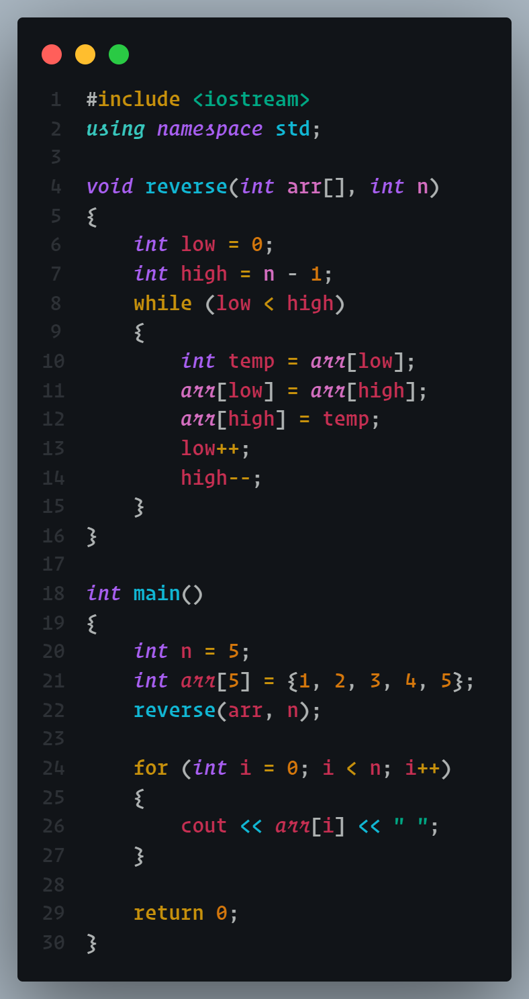
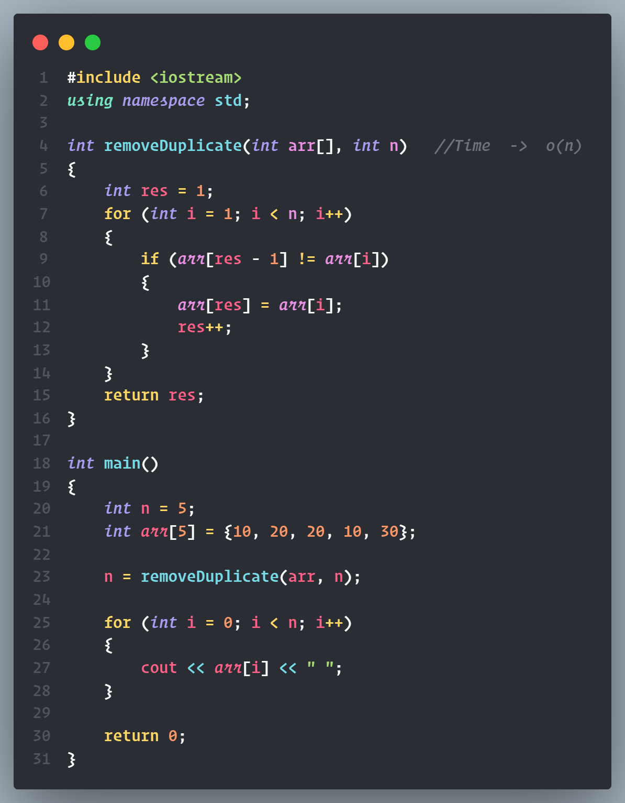
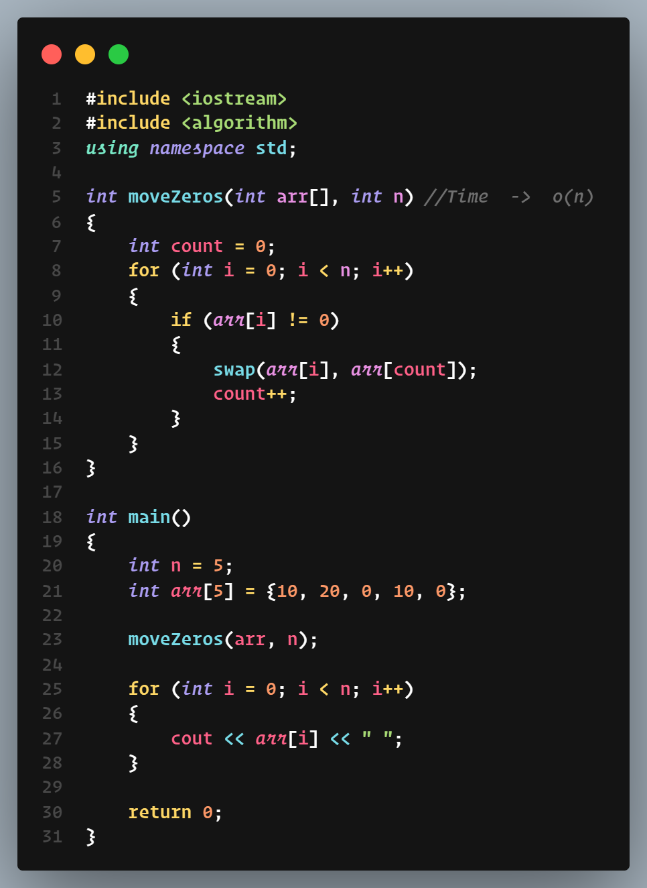
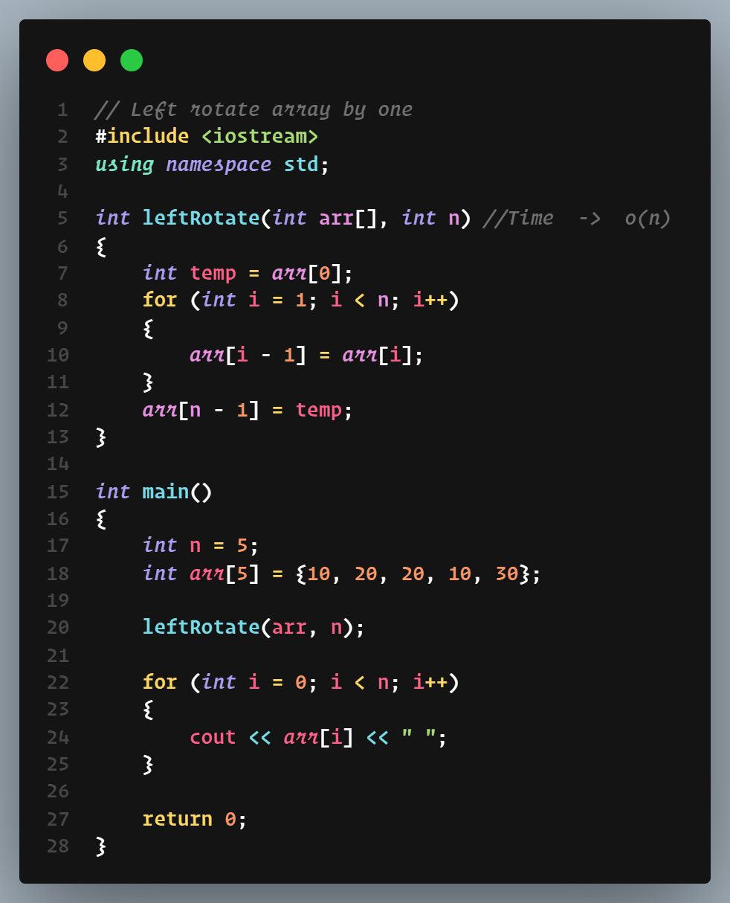
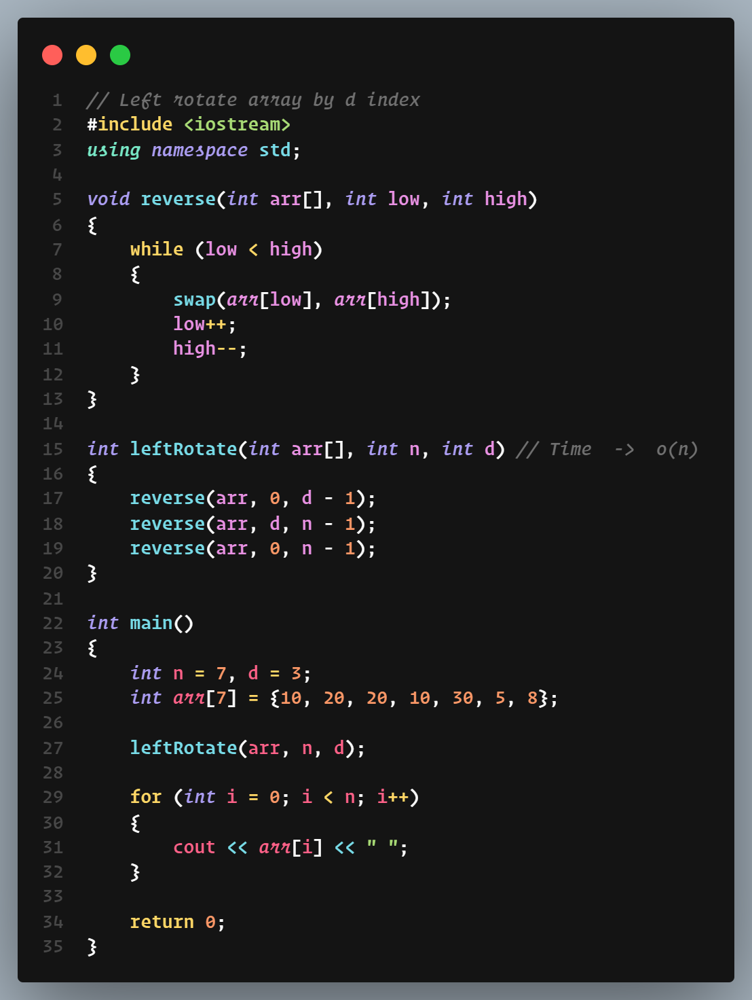

# Array

# 1. Linear Search

# 2. Largest element in array
## -> Naive

## -> Efficient

# 3

# 4. Check array is sorted or not
## -> naive

## -> Efficient

# 5. Reverse an array
## ->

# 6. Duplicates in a sorted array
## ->

# 7. Move zeroes at the end
##  ->

# 8. Left rotate array by one
##  ->

# 9. Left rotate array by d index
##  ->
